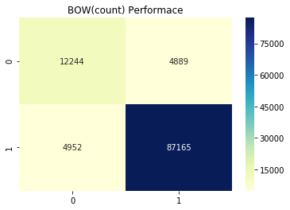

## Bag of Words

```
import pandas as pd 
import numpy as np
import matplotlib.pyplot as plt
import seaborn as sns

```


```
review_data = pd.read_pickle("review_data.pkl")
```


```
# Stratified Test Train Spilt

from sklearn.model_selection import train_test_split
X_train,X_test,y_train,y_test = train_test_split(review_data.Text,review_data.Sentiment,
                                                 test_size=0.3,stratify=review_data.Sentiment,
                                                 random_state=42)
X_train.shape
```


    (254914,)


```
#Creating Bag of words(count) for our dataset

from sklearn.feature_extraction.text import CountVectorizer

count_vector = CountVectorizer()
final_counts = count_vector.fit_transform(X_train.values)
print(final_counts.shape)
# here final_counts is sparse representation of document
```

    (254914, 96703)


```
# dictinary created by corpus

count_vector.get_feature_names()[-100:-120:-1]
```


    ['zoie',
     'zoid',
     'zohan',
     'zofchak',
     'zoey',
     'zoethout',
     'zoeie',
     'zoegas',
     'zoe',
     'zodiac',
     'zocor',
     'zo',
     'znaturalfoods',
     'zn',
     'zmtsa',
     'zloty',
     'zizzer',
     'ziyad',
     'ziwkpeak',
     'ziwipeaks']


```
print("dimention of single document is :",len(count_vector.get_feature_names()))
```

    dimention of single document is : 96703


**Conclusion** : Our BOW represention of document is sparse and have very very large dimention
The dimensionality can be imporved by using method like stemming,remove stop words etc.


```
# Naive bayes as classifier 

from sklearn.naive_bayes import MultinomialNB

clf =  MultinomialNB()
clf.fit(final_counts,y_train)
print(clf.score(final_counts,y_train))
X_test_bow = count_vector.transform(X_test)
print(clf.score(X_test_bow,y_test))
```

    0.9176271213036553
    0.9099221967963387


```
from sklearn.metrics import confusion_matrix

cnf = confusion_matrix(y_test,clf.predict(X_test_bow))
sns.heatmap(cnf,annot=True,fmt='g',cmap="YlGnBu");
plt.title("BOW(count) Performace");
```





