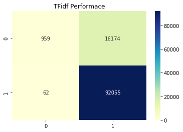

# Term frequency Inverse Document frequency (TFIDF)


```
import pandas as pd 
import numpy as np
import matplotlib.pyplot as plt
import seaborn as sns
```


```
# load preprocessed text
review_data = pd.read_pickle("review_data.pkl")
```


```
# Stratified Test Train Spilt

from sklearn.model_selection import train_test_split

X_train,X_test,y_train,y_test = train_test_split(review_data.Text,review_data.Sentiment,
                                                 test_size=0.3,stratify=review_data.Sentiment,random_state=42)
X_train.shape
```


    (254914,)


```
# Creating TFIDF Features

from sklearn.feature_extraction.text import TfidfVectorizer

tfidf_vec = TfidfVectorizer()
final_counts = tfidf_vec.fit_transform(X_train)
print(final_counts.shape)
```

    (254914, 96703)


```
# we use navie bayes as classifier because its known for its speed.
# here we need to perform several experiment to we go with speed rathar than accuracy
from sklearn.naive_bayes import MultinomialNB
clf =  MultinomialNB()
clf.fit(final_counts,y_train)
print(clf.score(final_counts,y_train))
X_test_bow = tfidf_vec.transform(X_test)
print(clf.score(X_test_bow,y_test))
```

    0.8556454333618396
    0.8513867276887872


```
# TFIDF row with non zero entry return row index, column index
final_counts[0,:].nonzero()

```


    (array([0, 0, 0, 0, 0, 0, 0, 0, 0, 0, 0, 0, 0, 0, 0, 0, 0, 0, 0, 0, 0, 0,
            0, 0, 0, 0], dtype=int32),
     array([93598, 91411, 86718, 77295, 52439, 93720, 87708, 55171, 80781,
            43875, 55386, 86696, 93382, 16309, 43874, 91874, 35557, 43667,
            87031, 94523, 29145, 15508, 82410, 47442, 59777, 64720],
           dtype=int32))


```
# look at some example
print(X_train.iloc[0])
# TFidf value of "We"
final_counts[0,93598]
```

    We used the seasoning last weekend to make some hamburgers. Man, that was the best hamburger I've ever had! This will definitely be a staple in my pantry.


    0.13741699990331868


```
# Checkout review with corresponding Tfidf value

tf_vocab=tfidf_vec.get_feature_names()
first_sentence =  [93598, 91411, 86718, 77295, 52439, 93720, 87708, 55171, 80781,
        43875, 55386, 86696, 93382, 16309, 43874, 91874, 35557, 43667,
        87031, 94523, 29145, 15508, 82410, 47442, 59777, 64720]
for value in first_sentence:
    print(tf_vocab[value],'\t\t\t',final_counts[0,value])
```

    we 			 0.13741699990331868
    used 			 0.15720499431001422
    the 			 0.10890297208741082
    seasoning 			 0.25888151501372736
    last 			 0.19158338281996679
    weekend 			 0.3293932269904595
    to 			 0.0630690672213203
    make 			 0.14558915778417017
    some 			 0.13478660228671113
    hamburgers 			 0.3767074432196095
    man 			 0.2980132553368805
    that 			 0.08696976286641608
    was 			 0.09859527013104034
    best 			 0.1416456275592033
    hamburger 			 0.339940485540104
    ve 			 0.1434246640619987
    ever 			 0.17620823351560547
    had 			 0.1272907654181933
    this 			 0.06594541619363117
    will 			 0.12431590678169643
    definitely 			 0.18570717353790192
    be 			 0.11085694952340505
    staple 			 0.2871979652088317
    in 			 0.07598041210316836
    my 			 0.08032741882170304
    pantry 			 0.2761146264606052


```
from sklearn.metrics import confusion_matrix

cnf = confusion_matrix(y_test,clf.predict(X_test_bow))
sns.heatmap(cnf,annot=True,fmt='g',cmap="YlGnBu");
plt.title("TFidf Performace");
```





**Conclusion** : TFIDF perform very poorly on our review dataset
