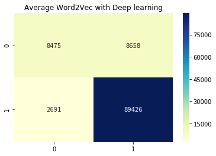

# Average Word2Vec Classifier


```
import pandas as pd 
import numpy as np
import matplotlib.pyplot as plt
import seaborn as sns
```


```
# load preprocessed text
review_data = pd.read_pickle("review_data.pkl")
```


```
!pip install gensim
```

    Requirement already satisfied: gensim in /usr/local/lib/python3.6/dist-packages (3.6.0)
    Requirement already satisfied: smart-open>=1.2.1 in /usr/local/lib/python3.6/dist-packages (from gensim) (1.8.3)
    Requirement already satisfied: scipy>=0.18.1 in /usr/local/lib/python3.6/dist-packages (from gensim) (1.2.1)
    Requirement already satisfied: six>=1.5.0 in /usr/local/lib/python3.6/dist-packages (from gensim) (1.12.0)
    Requirement already satisfied: numpy>=1.11.3 in /usr/local/lib/python3.6/dist-packages (from gensim) (1.16.3)
    Requirement already satisfied: requests in /usr/local/lib/python3.6/dist-packages (from smart-open>=1.2.1->gensim) (2.21.0)
    Requirement already satisfied: boto>=2.32 in /usr/local/lib/python3.6/dist-packages (from smart-open>=1.2.1->gensim) (2.49.0)
    Requirement already satisfied: boto3 in /usr/local/lib/python3.6/dist-packages (from smart-open>=1.2.1->gensim) (1.9.139)
    Requirement already satisfied: urllib3<1.25,>=1.21.1 in /usr/local/lib/python3.6/dist-packages (from requests->smart-open>=1.2.1->gensim) (1.24.2)
    Requirement already satisfied: chardet<3.1.0,>=3.0.2 in /usr/local/lib/python3.6/dist-packages (from requests->smart-open>=1.2.1->gensim) (3.0.4)
    Requirement already satisfied: certifi>=2017.4.17 in /usr/local/lib/python3.6/dist-packages (from requests->smart-open>=1.2.1->gensim) (2019.3.9)
    Requirement already satisfied: idna<2.9,>=2.5 in /usr/local/lib/python3.6/dist-packages (from requests->smart-open>=1.2.1->gensim) (2.8)
    Requirement already satisfied: jmespath<1.0.0,>=0.7.1 in /usr/local/lib/python3.6/dist-packages (from boto3->smart-open>=1.2.1->gensim) (0.9.4)
    Requirement already satisfied: botocore<1.13.0,>=1.12.139 in /usr/local/lib/python3.6/dist-packages (from boto3->smart-open>=1.2.1->gensim) (1.12.139)
    Requirement already satisfied: s3transfer<0.3.0,>=0.2.0 in /usr/local/lib/python3.6/dist-packages (from boto3->smart-open>=1.2.1->gensim) (0.2.0)
    Requirement already satisfied: docutils>=0.10 in /usr/local/lib/python3.6/dist-packages (from botocore<1.13.0,>=1.12.139->boto3->smart-open>=1.2.1->gensim) (0.14)
    Requirement already satisfied: python-dateutil<3.0.0,>=2.1; python_version >= "2.7" in /usr/local/lib/python3.6/dist-packages (from botocore<1.13.0,>=1.12.139->boto3->smart-open>=1.2.1->gensim) (2.5.3)


```
from gensim.models import Word2Vec
from gensim.models import KeyedVectors
from nltk.tokenize import word_tokenize
import multiprocessing

```


```
# Tokenize all corpus and store in X_data_w2v
def tokenize(review_data):
  """Input pandas dataFrame with Text Field Name and It return tokenize list"""
  X_data_w2v = []
  for i in range(review_data.shape[0]):
      token = word_tokenize(review_data.Text.iloc[i])
      X_data_w2v.append(token)
  return X_data_w2v

X_data_w2v = tokenize(review_data)
```


```
# Train word2vec from scratch

# cores = multiprocessing.cpu_count()
# w2v_model = Word2Vec(min_count=1,
#                      window=2,
#                      size=100,
#                      sample=6e-5, 
#                      alpha=0.03, 
#                      min_alpha=0.0007, 
#                      negative=20,
#                      workers=cores-1)

# Build vocabulary 
#w2v_model.build_vocab(X_data_w2v)
# Training
#w2v_model.train(X_data_w2v, total_examples=w2v_model.corpus_count, epochs=30, report_delay=1)


#make model memory and execution efficient only after completed training.
#w2v_model.init_sims(replace=True) 

# w2v_model.wv('Computer')
# w2v_model.wv.most_similar(positive=["Excellent"]) // similar word
# w2v_model.wv.similarity("Queen", 'Female') //similarity score
# w2v_model.wv.doesnt_match(['Cat', 'Tiger', 'Chair']) //odd one out

# Gives Train Accuracy 0.7959037165475416
# Gives Test Accuracy0.7948192219679634
```


```
# for twitter trained word2vec

#model = api.load("glove-twitter-25")
```


```
#Google News trained word2vec

!wget "https://s3.amazonaws.com/dl4j-distribution/GoogleNews-vectors-negative300.bin.gz"
model_w2v = KeyedVectors.load_word2vec_format('GoogleNews-vectors-negative300.bin.gz',binary=True) 
```


```
print("Vocabulary size of model : ",len(model_w2v.vocab))
```

    Vocabulary size of model :  3000000


```
def calculate_avg_w2v(X_data_w2v):
  """pass list of tokenize text return average word2vec"""
  X_data_w2v1 = []
  vocab_doc = []
  X_data_w2v = np.array(X_data_w2v)

  for i in range(len(X_data_w2v)):
      for value in X_data_w2v[i]:
          if value in model_w2v.vocab:
              vocab_doc.append(value)
      X_data_w2v[i]= vocab_doc
      vocab_doc = []
      temp = model_w2v.wv[X_data_w2v[i]]
      doc_word = temp.shape[0]
      temp = np.sum(temp,axis=0)/doc_word
      X_data_w2v1.append(temp)
  return X_data_w2v1

X_data_w2v1 = calculate_avg_w2v(X_data_w2v)

```

    /usr/local/lib/python3.6/dist-packages/ipykernel_launcher.py:13: DeprecationWarning: Call to deprecated `wv` (Attribute will be removed in 4.0.0, use self instead).
      del sys.path[0]


```
X_data_w2v1 = np.array(X_data_w2v1)
```


```
# Stratified Test Train Spilt

from sklearn.model_selection import train_test_split

X_train,X_test,y_train,y_test = train_test_split(X_data_w2v1,review_data.Sentiment,
                                                 test_size=0.3,stratify=review_data.Sentiment,
                                                 random_state=42)
```


```
print("Dimention of Review",X_train.shape[1])
```


    300


Note : Here Each Review represent by 300 dimension. less dimension means we can try various ML algorithm very fast. Unlike previous ones.


```
# Naive Bayes Algorithm
from sklearn.naive_bayes import GaussianNB

clf =  GaussianNB()
clf.fit(X_train,y_train)
print(clf.score(X_train,y_train))
print(clf.score(X_test,y_test))
```

    0.6830303553355249
    0.682233409610984


```
# Logistic Regression
from sklearn.linear_model import LogisticRegression

clf =  LogisticRegression()
clf.fit(X_train,y_train)
print(clf.score(X_train,y_train))
print(clf.score(X_test,y_test))
```

    /usr/local/lib/python3.6/dist-packages/sklearn/linear_model/logistic.py:433: FutureWarning: Default solver will be changed to 'lbfgs' in 0.22. Specify a solver to silence this warning.
      FutureWarning)


    0.8969142534344916
    0.8961189931350114


```
# Deep Learning Model

from keras.models import Sequential
from keras.layers import Dense, Dropout
from keras.optimizers import Adam

batch_size = 256
epochs = 30

model = Sequential()
model.add(Dense(100, activation='relu', input_shape=(300,)))
model.add(Dropout(0.1))
model.add(Dense(1, activation='sigmoid'))

model.compile(loss='binary_crossentropy',
              optimizer=Adam(),
              metrics=['accuracy'])
history = model.fit(X_train, y_train,
                    batch_size=batch_size,
                    epochs=epochs,
                    verbose=1,
                    validation_data=(X_test, y_test))
```

    Using TensorFlow backend.


    WARNING:tensorflow:From /usr/local/lib/python3.6/dist-packages/tensorflow/python/framework/op_def_library.py:263: colocate_with (from tensorflow.python.framework.ops) is deprecated and will be removed in a future version.
    Instructions for updating:
    Colocations handled automatically by placer.
    WARNING:tensorflow:From /usr/local/lib/python3.6/dist-packages/keras/backend/tensorflow_backend.py:3445: calling dropout (from tensorflow.python.ops.nn_ops) with keep_prob is deprecated and will be removed in a future version.
    Instructions for updating:
    Please use `rate` instead of `keep_prob`. Rate should be set to `rate = 1 - keep_prob`.
    WARNING:tensorflow:From /usr/local/lib/python3.6/dist-packages/tensorflow/python/ops/math_ops.py:3066: to_int32 (from tensorflow.python.ops.math_ops) is deprecated and will be removed in a future version.
    Instructions for updating:
    Use tf.cast instead.
    Train on 254914 samples, validate on 109250 samples
    Epoch 1/30
    254914/254914 [==============================] - 5s 21us/step - loss: 0.3152 - acc: 0.8679 - val_loss: 0.2593 - val_acc: 0.8897
    Epoch 2/30
    254914/254914 [==============================] - 4s 15us/step - loss: 0.2567 - acc: 0.8928 - val_loss: 0.2498 - val_acc: 0.8944
    Epoch 3/30
    254914/254914 [==============================] - 4s 15us/step - loss: 0.2508 - acc: 0.8960 - val_loss: 0.2455 - val_acc: 0.8971
    Epoch 4/30
    254914/254914 [==============================] - 4s 15us/step - loss: 0.2463 - acc: 0.8984 - val_loss: 0.2428 - val_acc: 0.8987
    Epoch 5/30
    254914/254914 [==============================] - 4s 15us/step - loss: 0.2433 - acc: 0.8997 - val_loss: 0.2406 - val_acc: 0.8994
    Epoch 6/30
    254914/254914 [==============================] - 4s 15us/step - loss: 0.2403 - acc: 0.9007 - val_loss: 0.2372 - val_acc: 0.9010
    Epoch 7/30
    254914/254914 [==============================] - 4s 15us/step - loss: 0.2379 - acc: 0.9022 - val_loss: 0.2378 - val_acc: 0.9012
    Epoch 8/30
    254914/254914 [==============================] - 4s 15us/step - loss: 0.2357 - acc: 0.9029 - val_loss: 0.2349 - val_acc: 0.9031
    Epoch 9/30
    254914/254914 [==============================] - 4s 15us/step - loss: 0.2338 - acc: 0.9040 - val_loss: 0.2318 - val_acc: 0.9034
    Epoch 10/30
    254914/254914 [==============================] - 4s 15us/step - loss: 0.2323 - acc: 0.9049 - val_loss: 0.2333 - val_acc: 0.9023
    Epoch 11/30
    254914/254914 [==============================] - 4s 15us/step - loss: 0.2307 - acc: 0.9051 - val_loss: 0.2300 - val_acc: 0.9045
    Epoch 12/30
    254914/254914 [==============================] - 4s 15us/step - loss: 0.2294 - acc: 0.9061 - val_loss: 0.2275 - val_acc: 0.9059
    Epoch 13/30
    254914/254914 [==============================] - 4s 16us/step - loss: 0.2276 - acc: 0.9068 - val_loss: 0.2350 - val_acc: 0.9006
    Epoch 14/30
    254914/254914 [==============================] - 4s 17us/step - loss: 0.2261 - acc: 0.9070 - val_loss: 0.2249 - val_acc: 0.9070
    Epoch 15/30
    254914/254914 [==============================] - 4s 16us/step - loss: 0.2248 - acc: 0.9079 - val_loss: 0.2244 - val_acc: 0.9070
    Epoch 16/30
    254914/254914 [==============================] - 4s 17us/step - loss: 0.2234 - acc: 0.9085 - val_loss: 0.2258 - val_acc: 0.9066
    Epoch 17/30
    254914/254914 [==============================] - 4s 16us/step - loss: 0.2225 - acc: 0.9089 - val_loss: 0.2231 - val_acc: 0.9071
    Epoch 18/30
    254914/254914 [==============================] - 4s 15us/step - loss: 0.2210 - acc: 0.9095 - val_loss: 0.2215 - val_acc: 0.9078
    Epoch 19/30
    254914/254914 [==============================] - 4s 16us/step - loss: 0.2201 - acc: 0.9099 - val_loss: 0.2222 - val_acc: 0.9084
    Epoch 20/30
    254914/254914 [==============================] - 4s 15us/step - loss: 0.2187 - acc: 0.9108 - val_loss: 0.2235 - val_acc: 0.9086
    Epoch 21/30
    254914/254914 [==============================] - 4s 15us/step - loss: 0.2178 - acc: 0.9111 - val_loss: 0.2202 - val_acc: 0.9090
    Epoch 22/30
    254914/254914 [==============================] - 4s 15us/step - loss: 0.2161 - acc: 0.9117 - val_loss: 0.2200 - val_acc: 0.9085
    Epoch 23/30
    254914/254914 [==============================] - 4s 15us/step - loss: 0.2153 - acc: 0.9122 - val_loss: 0.2186 - val_acc: 0.9094
    Epoch 24/30
    254914/254914 [==============================] - 4s 15us/step - loss: 0.2145 - acc: 0.9124 - val_loss: 0.2191 - val_acc: 0.9096
    Epoch 25/30
    254914/254914 [==============================] - 4s 15us/step - loss: 0.2130 - acc: 0.9133 - val_loss: 0.2170 - val_acc: 0.9100
    Epoch 26/30
    254914/254914 [==============================] - 4s 15us/step - loss: 0.2120 - acc: 0.9132 - val_loss: 0.2169 - val_acc: 0.9102
    Epoch 27/30
    254914/254914 [==============================] - 4s 15us/step - loss: 0.2116 - acc: 0.9135 - val_loss: 0.2166 - val_acc: 0.9103
    Epoch 28/30
    254914/254914 [==============================] - 4s 15us/step - loss: 0.2109 - acc: 0.9140 - val_loss: 0.2158 - val_acc: 0.9119
    Epoch 29/30
    254914/254914 [==============================] - 4s 15us/step - loss: 0.2098 - acc: 0.9146 - val_loss: 0.2165 - val_acc: 0.9111
    Epoch 30/30
    254914/254914 [==============================] - 4s 15us/step - loss: 0.2090 - acc: 0.9151 - val_loss: 0.2152 - val_acc: 0.9115


```
# Best Accurcy given by MLP model
print('Train Accuracy:',model.evaluate(X_train, y_train, verbose=0)[1])
print('Test Accuracy:',model.evaluate(X_test, y_test, verbose=0)[1])
```

    Train Accuracy: 0.917882109260378
    Test Accuracy: 0.9114782608695652


```
from sklearn.metrics import confusion_matrix

cnf = confusion_matrix(y_test,clf.predict(X_test))
sns.heatmap(cnf,annot=True,fmt='g',cmap="YlGnBu");
plt.title("Average Word2Vec with Deep learning");
```





Our Average Word2Vec Apppoch Gives Good Result but This approch don't outperform previous one.
