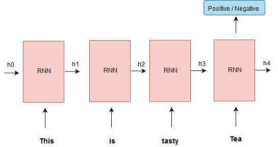

# Sentiment Analyzer
      

In this repository. we work with Natural Language Processing (NLP) and we try to build a State of the  art Sentiment Analyzer for Reviews using Amazon Fine Food Reviews dataset. we try different machine learning approch to solve our problem.
### Dataset
Our Target Machine learning problem is to create sentiment analyzer for reviews. so we need to prepare our dataset for problem. After getting data from source, It is looks like 

| id | ProductId | UserId | ProfileName | Score | HelpfulnessNumerator | HelpfulnessDenominator | Time | Summary | Text |
|----|------------|----------------|---------------------------------|-------|----------------------|------------------------|------------|-----------------------|-------------------------------------------|
|  1 | B001E4KFG0 | A3SGXH7AUHU8GW | delmartian | 5 | 1 | 1 | 1303862400 | Good Quality Dog Food | I have bought several of the Vitality... |
| 2 | B00813GRG4 | A1D87F6ZCVE5NK | dll pa | 1 | 0 | 0 | 1346976000 | Not as Advertised | Product arrived labeled as Jumbo... |
| 3 | B00813GRG4 | ABXLMWJIXXAIN | Natalia Corres | 4 | 1 | 1 | 1219017600 | "Delight" says it all | This is a confection that has been... |

### [Data preprocessing]()
we need to preprocess Data properly so that it make sense and suitable for machine learning models. so first step is Data preprocessing and we also do some feature engineering, after that our data looks like

| Text | Sentiment |
|---------------------------------------------------|-----------|
| I have to say I was a little apprehensive to b... | 1 |
| Received my free K cups as a sample promotion ... | 1 |
| Brooklyn "French Roast" K-Cup Coffee is not on... | 0 |

## Design Sentiment Analyzer
### Bag of Words
The bag-of-words model is a simplifying representation used in natural language processing and information retrieval (IR). In this model, a text (such as a sentence or a document) is represented as the bag (multiset) of its words.

**Example Training set** : "github is smart tool, it is used by smart developer" 

Features Generated by Bag of Words (BOW) is :

| VOCAB | github | is | smart  | tool | it | used | by | developer |
|-------|--------|----|--------|------|----|------|----|-----------|
|  | 1 | 2 | 2 | 1 | 1 | 1 | 1 | 1 |

* *Performace of Above approch* :

### Bag of Words with Stemming
So you think what is this Stemming why we use this? Calm down! I will explain each of this to you.

In Natural Language Processing, Stemming is the process of reducing inflected words to their word stem, base or root form. such that all related word treated as same. There are various stemmimg algorithm available to choose from like PorterStemmer, LancasterStemmer, SnowballStemmers, ISRIStemmer.

**Example** :
trouble,troubling,troubled => troubl
* *Performance of Bag of Words with Stemming is* :

### Bag of Words with Lemmatization
Lemmatization is the process of grouping together the inflected forms of a word so they can be analysed as a single item, identified by the word's lemma, or dictionary form.

**Example** :
studies,studing => study

Note : Stemming is fast as compare to Lemmatization but if you are working with language modeling then lemmatization is preferred.
* *Performance of Bag of Words with Lemmatization is* :
### Bag of Words with n-grams
Natual language have sequencial information which is critcal to make any NLP based decision. like meaning of word *Bank* changes with its surrounding word. like
1. *Bank* is generally close on Sunday.
2. River *Bank* looks beautiful in morning.

N-gram approch is one of the attempt to cover this sequence information. but it cover partial sequence information.

**Example Training set** : "github is smart tool, it is used by smart developer" 

Features Generated by Bag of Words (BOW) with Bi-gram is :

| VOCAB | github | is | smart  | tool | it | used | by | developer | github is | is smart | smart tool | tool it | it used | .. |
|-------|--------|----|--------|------|----|------|----|-----------|-----------|----------|------------|---------|---------|----|
|  | 1 | 2 | 2 | 1 | 1 | 1 | 1 | 1 | 1 | 1 | 1 | 1 | 1 |..|

* *Performance of Bag of Words with Lemmatization is* :

### Combined Approch

### Term Frequency Inverse Document frequency (TFIDF)
Term frequency–inverse document frequency is a numerical statistic that is intended to reflect how important a word is to a document in a collection or corpus.

*Term frequency* : Frequency of word appears in document.

*Inverse document frequency* : Inverse of frequency of word appear in corpus.

Wi,j = TFi,j * log( N/dfi)
 
* *Performance of TFIDF is* :

### Average Word2Vec
As name suggest, In Word2vec we represent word in the form of vector using embeddings. Word2vec takes as its input a large corpus of text and produces a vector space, typically of several hundred dimensions. To represent a document as Vector we average all Word2vec of given review.

**Example  Representation** : "this is remote"

|  | |   |  |  |
|---------|-----|------|-----|------|
| this | 0.2 |  0.3 | 0.6 | 0.04 |
| is | 0.5 | 0.1 | 0.2 | 0.16 |
| remote | 0.5 | 0.2 | 0.1 | 0.01 |
| **Avg W2V** | 0.4 | 0.2 | 0.3 | 0.07 |

* *Performance of Average Word2Vec* :

### Recurrent Neural Network with Word2Vec
Recurrent Neural Network is deep learning approch known for its sequence information capturing properties. Here we use Word2vec with many to one RNN architecture. 

* *Performance of RNN with Word2Vec* :

